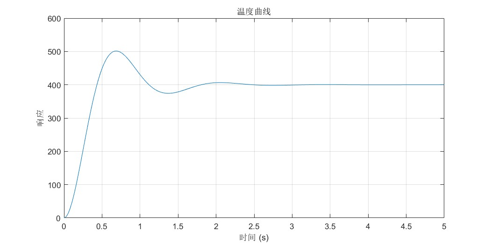

<!--
 * @Author: huangyouli.scut@gmail.com
 * @Date: 2025-05-16 14:58:18
 * @LastEditors: YouLiHuang huangyouli.scut@gmail.com
 * @LastEditTime: 2025-05-24 17:46:54
 * @Description: 
 * 
 * Copyright (c) 2025 by huangyouli, All Rights Reserved. 
-->
## 工程目录架构


### core
cortex-M4x内核相关

### LIB
- 标准外设库
- USB驱动库
- FATFS库

### USCOSⅢ
U/Cos操作系统相关

### HARDWARE
硬件相关驱动：ADC、PWM、SPI、触摸屏...

### MDK
keil目录

### SYSTEM
系统级文件：延时、stm32f4配置、IO位带操作

### 其他
- OBJ：输出中间文件
- readme：项目架构说明


## 代码总体架构


## 主线程

主要功能：
- 开机自检：识别热电偶，加载偏置参数
- 热点偶定期连接性检测，监测热电偶是否断开
- 实时焊接控制

## 触摸屏UI线程
主要功能：
- 获取当前页面id，判断所处页面
- 根据所处页面执行不同的UI功能（主要为轮询各个UI对象的属性值，如：按键值）
- 数据同步：将UI界面读取到的参数/属性值同步到`焊接控制器:weld_controller`

## 错误处理线程`最高优先级`
主要功能：
- 响应硬件错误如：热点偶错误、过流、欠压...
- 等待用户操作消除错误

## 上位机通信线程
主要功能：
- 根据上位机的指令完成数据接收处理
    - 修改单个参数
    - 修改多个参数
- 数据同步：将接收到的数据同步到`焊接控制器:weld_controller`

## USB读写线程
目前的USB线程主要功能：扫描当前U盘是否接入，获取U盘下的文件目录，并通过串口`log`进行输出

## 触摸屏通信架构
- 驱动文件：touchscreen.c
- 常用API：
```
// 获取页面id
bool Page_id_get(void);
// 设置UI组件属性值
bool command_set_comp_val(const char *name, const char *compatible, const int val);
// 获取UI组件属性值
bool command_get_comp_val(Component_Queue *list, const char *name, const char *compatible);
```
- 创建新的UI界面API：
```
// 创建新的UI列表
Page_Param *new_page_param(void);
// 初始化列表
bool page_list_init(Component_Queue *page_list, char *name_list[], uint8_t list_len);
```
- 基本流程
    - （1）通过串口将指令发送到串口屏
    - （2）等待（订阅信号量）串口返回（串口空闲中断发出信号量），更新组件列表对应的组件属性值

## 焊接控制策略讲解
- （1）焊接三个阶段，前两个阶段采用pid控制混合一些辅助策略
- （2）对于一阶段：经典的pid阶跃响应（定时器1ms中断完成一次增量式pid运算输出）
- （3）对于二阶段：将一个阶跃响应拆分为四段（冷启动——>pid闭环控制->动态开环热补偿->pid闭环控制）

### 控制策略详解
对于一个经典的阶跃响应曲线，如下图所示


我们将其拆分为多段进行控制

- `第一段`：限制pid控制器的最小输出（这一最小输出值取稳态输出值的预估）
- `第二段`：正常的pid闭环控制
- `第三段`：在临近目标值后，切换到开环控制，输出值取稳态输出值的预估（这一段的开环控制时间可调，通过gain2进行调节）
- `第四段`：再次切换回pid闭环控制

### 稳态输出的预估
（1）我们假定系统稳定时的输出和设定值是线性关系（实测如此/理论分析也可知道）
拟合一个曲线：output=k*set_point+b，先给定一个初始值k1和b1，经过一次闭环控制后，获取最终系统稳定时的输出值，记录为output_stable，修正曲线：`k=k*(output_stable/output) b=b*(output_stable/output)`每一次焊接完成都会如此修正一次，使得曲线最终能准确预估稳态输出值

（2）这一个稳态输出的预估值将会用到第一和第三阶段的控制当中
- 第一阶段：为了加速升温过程，但又不至于超调过冲
- 第三阶段：临近目标值后，使用开环控制让其直接逼近稳态，如果使用pid闭环继续则会出现**反向过冲**曲线凹陷（如下图所示），采用预估值进行开环控制可以直接使得温度曲线平滑过渡到目标值


### 最终的温控效果近似如下


## 动态控制基本思路
如图所示


